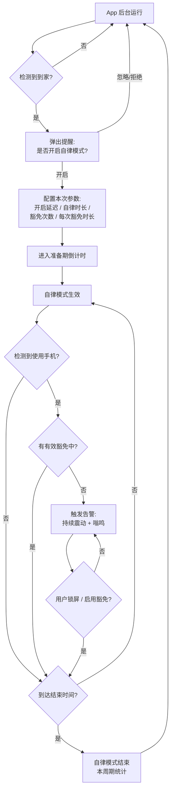
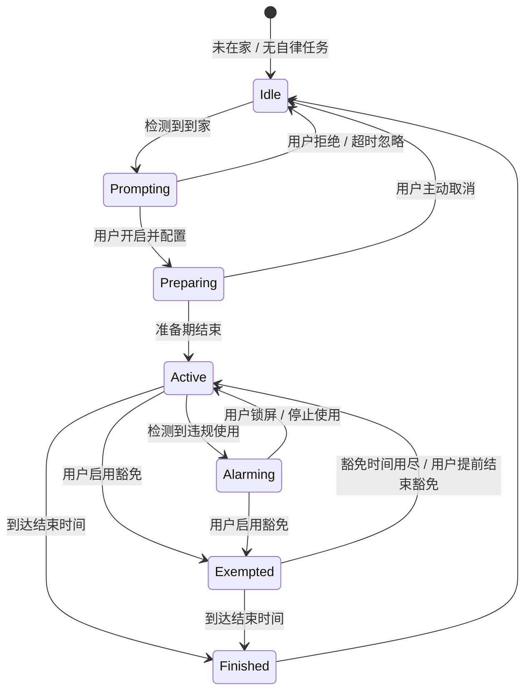

# 自律模式 App 设计文档

> 代号：**HomeLock（居家自律）**
> 版本：v0.1（设计草案，待确认）
> 平台：Android 优先，iOS 后续
> 更新日期：2026-08-16

---

## 1. 产品概述

### 1.1 要解决的问题
用户回到家后容易长时间无节制地玩手机。希望有一款 App 在「到家」这个时机主动介入，
引导用户进入一段**自律时间**，在这段时间里尽量不碰手机；一旦忍不住使用，手机会
**持续震动 + 嗡鸣告警**，用"打扰感"倒逼用户放下手机。同时保留少量**豁免额度**，
以应对确有急事需要处理的情况。

### 1.2 核心理念
- **触发时机智能化**：不靠用户自觉去开启，而是"到家"自动提醒。
- **惩罚式而非封锁式**：不追求技术上完全锁死手机（Android 上也做不到彻底封锁），
  而是让"违规使用"变得很难受（持续告警），提高使用成本。
- **保留人性化出口**：允许有限次数、有限时长的豁免，避免耽误急事。

### 1.3 目标用户
有自制力困扰、希望在家减少手机使用时长的个人用户。

---

## 2. 名词定义

| 名词 | 含义 |
|------|------|
| **到家检测** | App 判断用户是否已回到家的能力 |
| **自律模式** | 一段设定好的、期望不使用手机的时间段 |
| **准备期 / 开启延迟** | 从确认开启到自律模式真正生效之间的缓冲时间（"多久后开启"）|
| **自律时长 / 结束时间** | 自律模式生效持续多久（"多久后结束"）|
| **豁免** | 在自律时间内临时允许正常使用手机的额度 |
| **豁免次数 / 每次时长** | 一个自律周期内允许豁免几次、每次可用多久 |
| **告警** | 检测到违规使用时触发的持续震动 + 嗡鸣 |
| **违规使用** | 在自律时间内、且没有有效豁免的情况下使用手机 |

---

## 3. 核心用户流程



### 3.1 首次使用（引导）
1. 安装后引导授予必要权限（定位/WiFi、悬浮窗、通知、勿扰访问、忽略电池优化等，见第 8 节）。
2. 设置"家"的位置 / 家庭 WiFi。
3. 设置默认的自律模式参数（可每次调整）。

### 3.2 日常使用（主流程）
到家 → 收到提醒 → 一键开启（用默认参数）或微调参数 → 准备期 → 自律期 → 结束统计。

---

## 4. 状态机

App 的核心运行状态：



说明：
- **Preparing（准备期）**：给用户"把手头的事收尾/放下手机"的缓冲时间。此期间正常使用手机不告警。
- **Active（自律期）**：核心监控期。使用手机 → 告警。
- **Exempted（豁免期）**：Active 的子状态，豁免额度内正常使用不告警；到期自动回到 Active。
- **Alarming（告警期）**：只要满足"正在使用 + 无豁免"，就持续告警；一旦不满足立即停止。

---

## 5. 功能模块详细设计

### 5.1 到家检测模块
**目标**：低功耗、较准确地判断"用户到家"。

推荐方案（Android，多信号融合，优先级从上到下）：
1. **家庭 WiFi SSID 检测**（首选）：连接到指定家庭 WiFi = 到家。低功耗、准确。
2. **地理围栏 Geofencing**：以家为中心设置围栏，进入围栏触发。适合无 WiFi 或作为补充。
3. （可选）蓝牙：连接到家里的某个蓝牙设备。

**到家判定规则（去抖动）**：
- 需"从离家状态 → 进入家范围"的**状态翻转**才触发，避免在家里反复触发。
- 同一天/同一"到家会话"只提醒一次；用户拒绝后当天不再重复弹（可配置）。
- 可设置"仅在某时间段内检测"（如仅晚上 18:00–24:00）。

> ⚠️ 待确认（Q1）：到家检测优先用哪种方式？是否需要用户手动确认"我到家了"作为兜底？

### 5.2 自律模式配置模块
到家提醒后，进入配置页（也可在设置里预设默认值，做到一键开启）。

可配置项：
| 参数 | 说明 | 建议默认 | 取值范围（建议）|
|------|------|----------|----------------|
| 开启延迟 | 多久后正式开启 | 5 分钟 | 0–60 分钟 |
| 自律时长 | 持续多久后结束 | 2 小时 | 15 分钟–8 小时 |
| 豁免次数 | 本周期最多豁免几次 | 2 次 | 0–10 次 |
| 每次豁免时长 | 每次豁免可用多久 | 5 分钟 | 1–30 分钟 |

- 支持保存为"默认模板"，下次到家一键沿用。
- 可支持多套模板（如"工作日""周末""睡前"）。（P1，非首版必需）

### 5.3 自律运行 / 监控模块
**核心：如何判断"用户在使用手机"？**

Android 上的检测手段（组合使用）：
- **屏幕状态**：`SCREEN_ON` / 解锁（`USER_PRESENT`）广播 → 判断是否点亮并解锁。
- **前台应用**：无障碍服务（AccessibilityService）或 `UsageStatsManager` → 判断当前在用哪个 App。

两种"违规"口径（待确认，见 Q2）：
- **口径 A（整机）**：只要在自律期内点亮并解锁手机使用 = 违规（最严格，符合"别让我用手机太久"）。
- **口径 B（按 App）**：只有打开"分心类 App"（社交/短视频/游戏等黑名单）才算违规，接电话/看时间不算。

> 建议首版做**口径 A**（整机），实现更简单、约束更强；口径 B 作为 P1 增强。

**告警触发的时机（待确认，见 Q3）**：
- 方案一（即时）：一解锁使用就告警。
- 方案二（宽限）：使用累计超过 X 秒才告警（给"看一眼时间/通知"留余地）。
- 建议：给一个很短的宽限（如 10 秒）+ 屏幕上先出现全屏遮罩劝返，再升级为告警。

**常驻运行**：
- 使用**前台服务（Foreground Service）** + 常驻通知，保证监控不被系统杀死。
- 监听开机广播（`BOOT_COMPLETED`），重启后恢复未结束的自律任务（依据持久化的结束时间）。

### 5.4 豁免模块
- 自律期/告警期内，用户可点击"我有急事，使用豁免"。
- 消耗一次豁免额度，进入豁免期，倒计时"每次豁免时长"。
- 豁免期内正常使用、不告警；顶部/通知栏显示剩余豁免时间。
- 豁免到期：先给临近提醒（如剩 30 秒轻震动预告），到期自动回到 Active；若仍在使用则重新进入告警。
- 豁免次数用尽后，"使用豁免"按钮置灰不可用。
- 待确认（Q4）：豁免是否可提前手动结束以节省额度？剩余额度是否跨周期清零（建议每周期清零）。

### 5.5 告警模块
**目标**：让"违规使用"很难受，但不至于扰民/危险。

- **持续震动**：使用较强的震动 pattern，循环播放。
- **持续嗡鸣**：使用 `ALARM` 音频流播放告警音，**可穿透静音/勿扰**（需勿扰访问权限）。
- **全屏劝返界面**（可选）：用悬浮窗/全屏 Activity 盖住当前界面，显示"自律模式进行中"，
  提供两个出口：① 放下手机（锁屏/返回，停止告警）；② 使用豁免。
- **停止条件**：锁屏、或不再检测到使用、或启用豁免 → 立即停止震动与声音。
- **安全边界（重要，待确认 Q5）**：
  - 是否对**来电、闹钟、地图导航、紧急呼叫**等场景放行不告警？（强烈建议放行来电与紧急场景）
  - 音量、震动强度是否可调，是否设"最大扰民时长"上限以防意外。

---

## 6. 数据模型（草案）

```text
HomeConfig            // 家的定义
  - homeWifiSsids: List<String>
  - geofence: { lat, lng, radiusMeters }
  - detectWindow: { startTime, endTime }   // 可选：仅此时段检测

DisciplineTemplate    // 自律参数模板
  - id, name
  - startDelayMinutes
  - durationMinutes
  - exemptionCount
  - exemptionMinutesEach
  - isDefault

DisciplineSession     // 一次自律周期的运行时状态（持久化）
  - id
  - templateSnapshot           // 本次使用的参数快照
  - state                      // Preparing / Active / Exempted / Alarming / Finished
  - startAt, prepareEndAt, endAt
  - exemptionsUsed
  - currentExemptionEndAt
  - createdAt

UsageEvent            // 统计用
  - sessionId
  - type                       // Unlock / Violation / AlarmStart / AlarmStop / ExemptionUsed
  - timestamp, durationMs
```

---

## 7. 界面 / 页面清单

| 页面 | 说明 |
|------|------|
| 引导/权限页 | 首次启动，逐项申请权限、设置家 |
| 首页/仪表盘 | 当前状态、今日/历史自律统计、快捷开启 |
| 到家提醒 | 通知 + 弹窗，"开启自律模式?" |
| 参数配置页 | 四个参数的设置，保存为模板 |
| 自律进行中页 | 剩余时间、剩余豁免、"使用豁免"按钮 |
| 全屏劝返/告警页 | 违规时弹出，含"放下手机 / 使用豁免" |
| 设置页 | 家/WiFi、默认模板、告警强度、放行清单、权限自检 |
| 统计页 | 自律时长、违规次数、豁免使用等趋势（P1）|

---

## 8. Android 技术方案与权限清单

### 8.1 关键权限
| 权限 / 能力 | 用途 | 说明 |
|-------------|------|------|
| `ACCESS_FINE_LOCATION` / `ACCESS_BACKGROUND_LOCATION` | 地理围栏、WiFi SSID 读取 | Android 10+ 读 SSID 需定位权限 |
| `ACCESS_WIFI_STATE` / `CHANGE_WIFI_STATE` | 检测家庭 WiFi | |
| `FOREGROUND_SERVICE` + 常驻通知 | 持续监控不被杀 | Android 14 需声明前台服务类型 |
| `RECEIVE_BOOT_COMPLETED` | 重启后恢复任务 | |
| `SYSTEM_ALERT_WINDOW`（悬浮窗）| 全屏劝返/遮罩 | 需用户手动授予 |
| 无障碍服务（AccessibilityService）| 检测前台 App（口径 B）| 敏感权限，需引导授予 |
| `PACKAGE_USAGE_STATS`（使用情况访问）| 前台 App/使用时长（替代/补充无障碍）| 需用户手动授予 |
| 勿扰访问（`ACCESS_NOTIFICATION_POLICY`）| 让告警穿透静音/勿扰 | |
| `POST_NOTIFICATIONS` | Android 13+ 发通知 | |
| 忽略电池优化 | 降低被系统杀概率 | 引导用户手动开启 |
| `VIBRATE` | 震动告警 | |

### 8.2 架构要点
- **前台服务**为核心，承载：到家检测、状态机、监控、告警。
- 状态与结束时间**持久化**（DB/Prefs），支持重启恢复、进程被杀后由 `AlarmManager`/`WorkManager` 兜底唤醒。
- 告警声音走 `AudioManager.STREAM_ALARM`；配合勿扰访问确保能响。
- **各厂商适配**（小米/华为/OV 等对后台限制严格）：需引导用户加白名单/自启动，作为已知风险项。

### 8.3 Android 的能力边界（务必知悉）
- Android **无法**真正"锁死"手机让第三方 App 完全禁止使用（除非用 Device Owner/MDM，普通消费级 App 做不到）。
- 因此本产品定位是**强打扰 + 劝返**，用户理论上仍可强行绕过（如卸载 App）。这是刻意的设计取舍，而非缺陷。
- 若未来想要更强约束，可探索 Device Admin/家长控制方向（复杂度与门槛高，暂列 P2）。

---

## 9. 边界情况

| 场景 | 处理策略 |
|------|----------|
| 自律期间离开家 | 待确认（Q6）：自动结束？还是继续到结束时间？建议"可配置，默认继续" |
| 手机重启 | 开机广播恢复未结束的 session（按持久化的 endAt） |
| App 被系统杀死 | 前台服务 + WorkManager/AlarmManager 兜底重启 |
| 来电 / 紧急呼叫 | 强烈建议放行，不告警（安全考虑）|
| 闹钟 / 导航 | 建议加入放行清单 |
| 用户手机静音/勿扰 | 通过勿扰访问 + ALARM 流穿透 |
| 豁免用尽仍要用 | 只能承受告警，或等待结束（体现约束力）|
| 用户直接卸载 App | 消费级 App 无法防止，列为已知局限 |

---

## 10. 开放问题（请 review 时重点确认）

| 编号 | 问题 | 我的默认建议 |
|------|------|--------------|
| **Q1** | 到家检测优先用哪种方式？是否要"手动确认到家"兜底？ | WiFi 首选 + 地理围栏补充 + 手动兜底 |
| **Q2** | 违规口径：整机（用手机就算）还是按 App（只有黑名单 App 算）？ | 首版整机（口径 A），按 App 作为 P1 |
| **Q3** | 告警触发时机：即时 / 累计超时 / 先遮罩后告警？ | 短宽限(10s)+先全屏劝返再升级告警 |
| **Q4** | 豁免可否提前结束以省额度？额度是否每周期清零？ | 可提前结束；每周期清零 |
| **Q5** | 告警放行清单（来电/闹钟/导航/紧急）包含哪些？ | 至少放行来电与紧急呼叫 |
| **Q6** | 自律期间离家如何处理？ | 可配置，默认继续到结束 |
| **Q7** | 是否需要"防作弊"（如禁止在自律期改设置/关闭 App）？强到什么程度？ | 首版做轻度（改设置需二次确认），不做硬防 |
| **Q8** | App 名称与视觉风格偏好？ | 暂用代号 HomeLock，待定 |

---

## 11. 里程碑规划（建议）

- **M0 设计确认**：本文档 + 交互原型 review 通过。
- **M1 Android MVP**：WiFi 到家检测 + 到家提醒 + 参数配置 + 整机监控 + 告警 + 豁免（口径 A）。
- **M2 增强**：地理围栏、按 App 黑名单（口径 B）、统计页、多模板、放行清单完善。
- **M3 稳定性**：各厂商后台保活适配、边界场景打磨。
- **M4 iOS 版**：受 iOS 后台限制，方案需重新评估（见下）。

### iOS 预研提示（后续）
iOS 后台常驻与"检测使用/告警"能力受限严格：
- 到家检测可用 CoreLocation 地理围栏 / 显著位置变化。
- "限制使用"官方路径是 **Screen Time / Family Controls (ManagedSettings + DeviceActivity)** 框架，
  行为与 Android 差异大，无法自由"持续告警"，需在 M4 单独设计。

---

## 附：一句话总结
**到家自动提醒 → 一键进入自律 → 违规使用就持续震动嗡鸣劝返 → 急事可有限豁免。**
核心是"强打扰式劝返 + 有限出口"，而非技术封锁。
